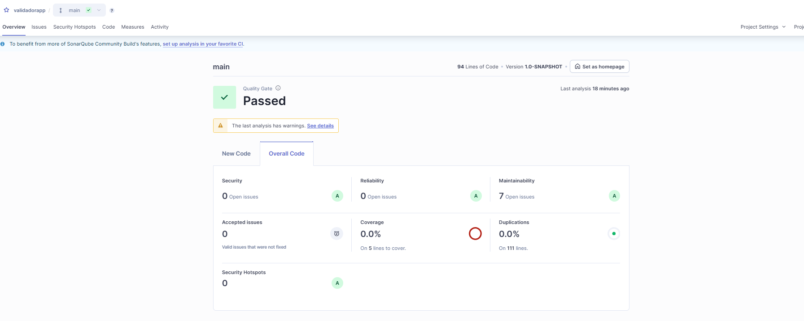
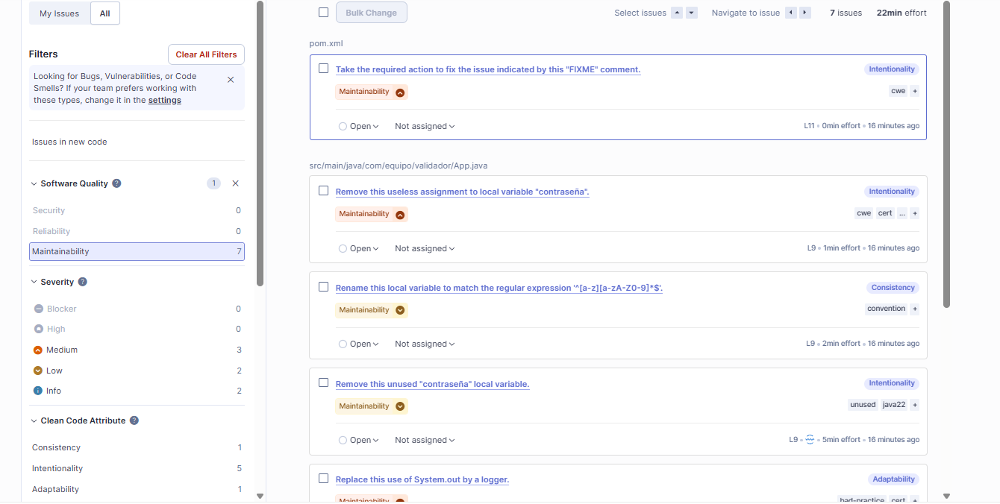
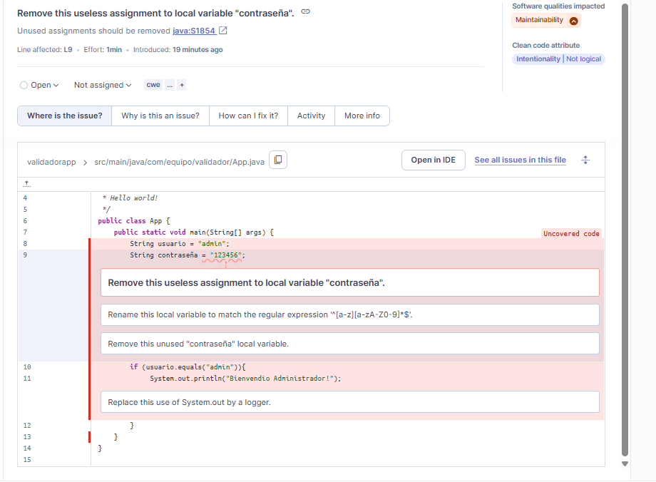
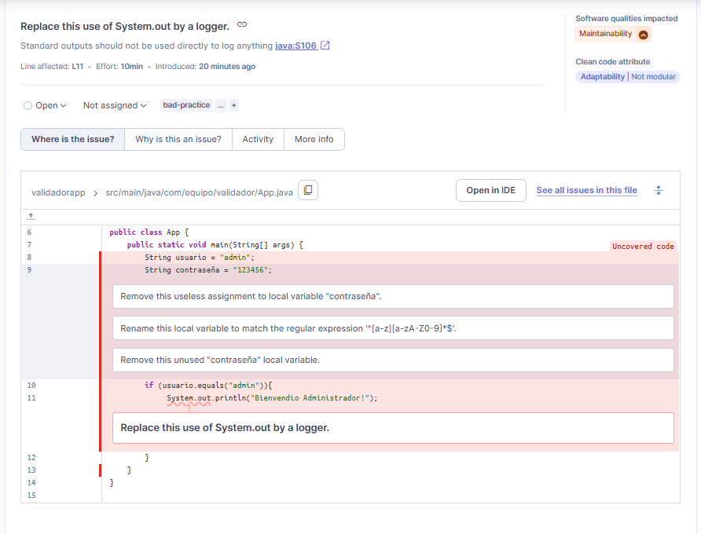
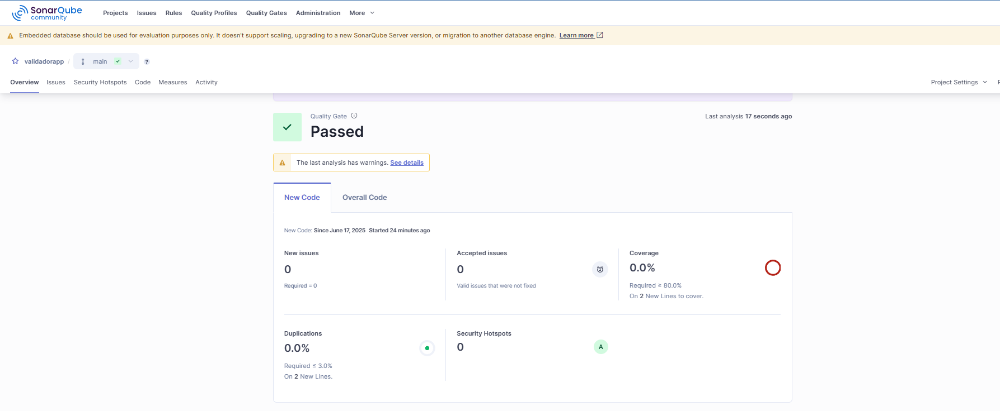

🛠️ Algunos Errores de Primera Instancia Detectados por SonarQube
Este documento reúne una serie de errores comunes identificados automáticamente por herramientas de análisis estático (como SonarQube). Estos errores suelen ser el primer paso hacia la mejora de la calidad del código.

🛠️ Primera pantalla de errores

🛠️ Segunda pantalla de errores

📌 1. Comentarios FIXME en pom.xml
<!-- FIXME change it to the project's website -->
<url>http://www.example.com</url>
Descripción:
El comentario FIXME indica que la URL del proyecto aún no ha sido actualizada y sigue apuntando a una dirección genérica.
Solución:
Actualizar la URL a la del repositorio o sitio real del proyecto.

📌 2. Variable local no usada
String contraseña = "123456"; // Remove this unused "contraseña" local variable.
Descripción:
La variable contraseña es declarada pero no se utiliza en ninguna parte del código.
Solución:
Eliminar la variable si no es necesaria, o utilizarla correctamente si forma parte del flujo lógico.

📌 3. Asignación innecesaria
String contraseña = "123456"; // Remove this useless assignment to local variable "contraseña".
Descripción:
La asignación a la variable contraseña es innecesaria si no se va a usar.
Solución:
Eliminar la asignación o usar la variable adecuadamente.

📌 4. Nombre de variable no cumple convenciones
String contraseña = "123456"; // Rename this local variable to match the regular expression '^[a-z][a-zA-Z0-9]*$'.
Descripción:
El nombre contraseña contiene un carácter especial (ñ) que puede ser inválido bajo ciertas convenciones de codificación.
Solución:
Renombrar la variable, por ejemplo: contrasena.

📌 5. Uso de System.out en lugar de un logger
System.out.println("Bienvendio Administrador!"); // Replace this use of System.out by a logger.
Descripción:
El uso de System.out.println no es adecuado para aplicaciones profesionales.
Solución:
Utilizar una librería de logging como java.util.logging, log4j o SLF4J.

📌 6. Código no cubierto por pruebas (Uncovered code)
public class App {
    public static void main(String[] args) {
        String usuario = "admin";
        // ...
    }
}
Descripción:
La clase o método principal no está siendo cubierto por pruebas automatizadas.
Solución:
Agregar pruebas unitarias que ejerciten este código, idealmente con assertions que validen su comportamiento.

🛠️ Imagen con las Correcciones Aplicadas

Preguntas Finales
¿Qué tipo de errores detectó SonarQube que podrían haber pasado desapercibidos?
SonarQube encontró errores como variables declaradas pero no usadas, comentarios pendientes de corrección (FIXME), nombres de variables que no siguen las buenas prácticas, y el uso de System.out.println en lugar de un sistema de logging. Son detalles pequeños que pueden pasar inadvertidos, pero que afectan la calidad y mantenimiento del código.

¿Qué ventajas tiene el análisis estático respecto al dinámico?
El análisis estático examina el código sin ejecutarlo, permitiendo detectar problemas temprano, como errores de estilo, convenciones, seguridad o código innecesario. Es rápido y puede aplicarse a todo el código automáticamente. En cambio, el análisis dinámico requiere ejecutar el programa y detecta fallos en tiempo real, como errores de ejecución o problemas de rendimiento.

¿Cómo impacta SonarQube en la calidad del software antes del despliegue?
Ayuda a entregar un código más limpio, confiable y fácil de mantener, detectando errores antes de que lleguen a producción. Esto reduce riesgos, previene bugs y fomenta buenas prácticas en el equipo, disminuyendo la deuda técnica.

¿Qué políticas o reglas personalizarías según el tipo de proyecto?
En proyectos abiertos, enfocarse en legibilidad y documentación para facilitar colaboraciones.

En proyectos críticos, activar reglas estrictas de seguridad y manejo de datos sensibles.

En proyectos pequeños o educativos, mantener reglas flexibles para favorecer el aprendizaje sin frenar el desarrollo.
